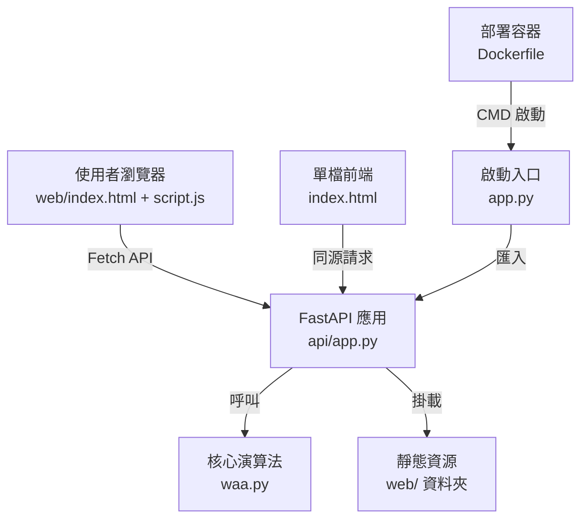

# 1. 專案摘要
本專案是一套以 FastAPI 為後端、原生 HTML/JavaScript 為前端的百家乐敏感鞋（Sensitive Shoe）生成與分析工具。後端透過 `waa.py` 中的大量牌局模擬與規則調整演算法生成符合訊號花色的牌靴，並提供切牌命中統計、直式牌序匯出等資料。前端頁面重心在於操作性：使用者可以設定訊號花色、請求生成牌靴、模擬切牌、快速檢視剩餘花色分布並匯出分析報表。整體架構著重於單機部署（Docker 或裸機 Uvicorn），共用同一個 FastAPI 服務提供 API 與靜態資源。
uvicorn app:app --host 127.0.0.1 --port 7860 
## 2. 目錄樹（至第 4 層）
```text
.
├─app.py
├─waa.py
├─api/
│  ├─__init__.py
│  ├─app.py
│  └─__pycache__/...
├─web/
│  ├─index.html
│  ├─script.js
│  └─style.css
├─docs/
│  └─PROJECT_OVERVIEW.md
├─index.html
├─Dockerfile
├─requirements.txt
├─README.md
├─folder_overview.txt
├─紅黑.txt
├─.github/
│  └─copilot-instructions.md
├─.venv/
│  ├─Lib/
│  │  └─site-packages/...
│  └─Scripts/...
└─__pycache__/
   └─...
```

## 3. 檔案責任表
| 路徑 | 角色/職責 | 主要匯出/路由 | 關鍵相依 | 被誰使用 | 風險 |
| --- | --- | --- | --- | --- | --- |
| `app.py` | 容器及本地部署的啟動入口，轉出 FastAPI 物件 | `app` 模組層級物件；`__main__` 時呼叫 `uvicorn app:app` | `api.app`, `uvicorn`, `os` | Docker CMD、開發者直接執行 | 僅支援單進程，未處理多工作者設定 |
| `api/__init__.py` | 標記 `api` 資料夾為套件 | 無 | 無 | `app.py`、匯入路徑解析 | 若移除會破壞匯入（低風險） |
| `api/app.py` | FastAPI 服務主體與全域狀態管理 | `app`、靜態掛載 `/` | `fastapi`, `waa`, `StaticFiles`, `CORSMiddleware` | `app.py`、瀏覽器 API 呼叫 | 對 `waa` 的例外處理有限；全域 STATE 缺乏鎖 |
| `api/app.py:114` `_serialize_rounds` | 將 `waa.Round` 物件序列化成前端 JSON 資料 | 無路由，供內部呼叫 | `waa.Round`, `_suit_letter` | `generate_shoe`, `simulate_cut` | 假設 `waa` 回傳結構完整，缺少守護 |
| `api/app.py:204` `_serialize_rounds_with_flags` | 計算 S_idx 與 tail 標記，補上旗標資訊 | 無路由 | `waa.compute_sidx_new`, `waa.RoundView` | `generate_shoe`, `simulate_cut` | 依賴 `waa` 的演算法常數，失敗時僅捕捉為空集合 |
| `api/app.py:254` `_rebuild_after_cut` | 依切點重新模擬牌局 | 無路由 | `waa.Simulator` | `simulate_cut`, `generate_shoe` Fallback | 缺乏錯誤回傳細節，遇到異常僅回空陣列 |
| `api/app.py:272` `POST /api/generate_shoe` | 生成敏感鞋、整理回應 | `rounds`, `suit_counts`, `vertical`, `meta` | `waa.generate_all_sensitive_shoe_or_retry`, `_serialize_rounds_with_flags` | 前端 `generateShoe`、CLI/自動化 | 大量迴圈，長時間運算恐阻塞；例外訊息未本地化 |
| `api/app.py:344` `POST /api/simulate_cut` | 以既有牌靴模擬切牌結果 | 同上但無 meta | `_rebuild_after_cut`, `waa.apply_shoe_rules` | 前端 `simulateCut` | 依賴快取的 `STATE["deck"]`，未保護並行更新 |
| `api/app.py:371` `POST /api/scan` | 預留掃描 API，目前僅回空 | `{"hits": [], "count": 0}` | 無（尚未實作） | 前端 `scanRounds` | 功能缺失；需明確標示未實作 |
| `api/app.py:378` `GET /api/export/vertical` | 匯出直式牌序純文字 | `text/plain` | `STATE["rounds"]`, `STATE["tail"]` | 前端 `exportCombined`、使用者直接下載 | 依賴快取；資料不存在時只有簡短字串 |
| `api/app.py:387` `GET /api/export/cut_hits.csv` | 匯出切牌命中統計 CSV | CSV 檔串流 | `waa.simulate_all_cuts`, `csv` | 前端 `exportCombined` | 大量計算及 I/O；未限制檔案大小 |
| `waa.py` | 核心演算法：牌靴生成、訊號規則、匯出工具 | 多數函式、資料類別 | `random`, `dataclasses`, `itertools` | `api.app`, 命令列模式 | 中文註解採 Big5（疑似），跨平台顯示亂碼 |
| `waa.py:95` `build_shuffled_deck` | 建立 8 副牌的洗牌結果 | `List[Card]` | `random.shuffle`, 常數 `NUM_DECKS` | `generate_all_sensitive_shoe_or_retry` 等 | 無洗牌種子時不可重現；SEED 預設 `None` |
| `waa.py:104` `class Simulator` | 逐局模擬與補牌邏輯 | `simulate_round`, `_swap_result` | `Card`, `Round` | `_rebuild_after_cut`, `scan_all_sensitive_rounds` | 未檢查切牌索引越界的行為 |
| `waa.py:747` `generate_all_sensitive_shoe_or_retry` | 主循環產生敏感鞋 | `(rounds, tail, deck)` | `pack_all_sensitive_once`, `apply_shoe_rules` | `generate_shoe` | 最高嘗試次數大（100 萬），潛在耗時 |
| `waa.py:772` `simulate_all_cuts` | 逐切點統計命中與局數 | `(rows, avg_hit, avg_rounds)` | `first_hit_after_single_cut` | 匯出 CSV、前端摘要 | 計算複雜度與資料量成正比，需注意性能 |
| `waa.py:794/878/922` 匯出函式 | 將資料寫入 CSV/直式檔 | 檔案路徑字串 | `csv`, `os.path` | CLI 模式 | 在 API 模式未直接使用，但程式仍可呼叫；需注意路徑權限 |
| `waa.py:996` `apply_shoe_rules` | 強制套用花色、顏色規則 | `(rounds, tail)` | 多個 helper（`enforce_suit_distribution` 等） | 生成與切牌流程 | 規則失敗時拋 `RuntimeError`，API 僅簡單重試 |
| `web/index.html` | 主前端版型與操作表單 | 按鈕、輸入欄位、Modal | `script.js`, `style.css` | 瀏覽器、FastAPI 靜態掛載 | 內文存在亂碼字元，需統一編碼 |
| `web/script.js` | 前端控制器、資料繪製、匯出處理 | `generateShoe`, `simulateCut`, `exportCombined` 等 | Fetch API, DOM API | 使用者瀏覽器 | 缺乏錯誤重試與國際化；依賴後端欄位固定 |
| `web/style.css` | 前端深色主題與排版 | 無 | CSS 自訂變數 | `web/index.html` | 純 CSS，無大風險，但與 HTML 稱號亂碼關聯 |
| `index.html` | 獨立單頁版本（含內嵌 CSS/JS） | 內嵌腳本與結構 | DOM, Fetch API | 可能作為舊版靜態入口 | 與 `web/` 重複邏輯，易造成維護負擔 |
| `Dockerfile` | 容器化建置流程 | CMD `uvicorn app:app --host 0.0.0.0 --port 7860` | `python:3.11-slim`, `requirements.txt` | 部署平台 | 缺少健康檢查與多階段建置；未設定非 root 使用者 |
| `requirements.txt` | Python 套件需求 | `fastapi==0.110.1`, `uvicorn[standard]==0.30.1` | PyPI | Docker build、pip 安裝 | 未鎖定 `waa` 等其他依賴；套件升級需測試 |
| `README.md` | 簡易描述 | Frontmatter 設定 | 無 | 人類閱讀 | 幾乎沒有使用說明，需補充 |
| `紅黑.txt` | 前端/規則筆記（疑似） | 未知 | 未知 | 開發者參考 | 未知（檔案疑似 Big5 編碼，需轉成 UTF-8 取得內容） |
| `.github/copilot-instructions.md` | 協作／AI 提示 | 指導文字 | GitHub Copilot | 協作者 | 與執行無直接關聯，低風險 |

## 4. 模組相依關係圖


## 5. 進入點與啟動流程（含資料流）
1. 部署時 Docker 依指令 `uvicorn app:app --host 0.0.0.0 --port 7860` 啟動；本地開發亦可直接執行 `python app.py` 使用相同入口。`app.py` 僅重新匯出 `api.app` 中的 FastAPI 實例，方便各種宿主平台讀取。
2. 使用者透過瀏覽器載入 `web/index.html`（或歷史的 `index.html`），前端腳本 `web/script.js` 會在 `DOMContentLoaded` 時綁定操作事件，維護一份前端 `STATE`。任何按鈕操作都會呼叫 REST API。
3. `POST /api/generate_shoe` 會先依請求覆寫 `waa` 的可調參數，呼叫核心演算法生成敏感鞋。成功後，後端會更新全域 `STATE`（rounds、tail、deck）並回傳序列化的回合資訊、剩餘花色統計、直式牌序與 `meta` 摘要。`web/script.js` 接收到資料後，重新渲染回合表格、牌靴網格、剩餘花色統計。
4. 後續的 `POST /api/simulate_cut` 會取用快取的 deck 再模擬切牌，重新套用規則並回傳最新回合資料，流程與生成類似。前端再呼叫 `GET /api/export/*` 取得 CSV 與牌靴直式檔案，並提供合併下載。
5. `POST /api/scan` 目前尚未實作實際邏輯，固定回傳 0；前端將結果顯示在提示區。所有資料交換都透過 JSON 或純文字/CSV 進行，無資料庫，狀態保留在後端記憶體中。

## 6. API／路由一覽
| 方法 | 路徑 | 處理器 | 資料模型 |
| --- | --- | --- | --- |
| POST | `/api/generate_shoe` | `api/app.py:272 generate_shoe` | 請求 `GenReq`：`num_shoes`（int）、`signal_suit`（str）、`tie_signal_suit`（可選），回應含 `rounds[]`（序列化回合）、`suit_counts{}`、`vertical`（直式字串）、`meta`（長度與 fallback 標記） |
| POST | `/api/simulate_cut` | `api/app.py:344 simulate_cut` | 請求 `CutReq`：`cut_pos`（int），回應 `rounds[]`、`suit_counts{}`、`vertical`，發生錯誤時回 `{error, detail}` |
| POST | `/api/scan` | `api/app.py:371 scan` | 請求 `ScanReq`：`banker_point`、`player_point`、`used_cards`；目前回 `{hits: [], count: 0}` |
| GET | `/api/export/vertical` | `api/app.py:378 export_vertical_plain` | 無請求體；回應內容為純文字直式牌序，無資料時回字串 `"No data"` |
| GET | `/api/export/cut_hits.csv` | `api/app.py:387 export_cut_hits_csv` | 無請求體；成功時回 CSV（含標題列、平均列），HTTP 404 表示尚未生成資料，503 表示 `waa` 模組不可用 |
| 靜態 | `/` | `StaticFiles(directory="web", html=True)` | 直接提供 `web/` 下的 HTML/CSS/JS；未特別處理快取標頭 |

## 7. 設定與環境變數
| 名稱 | 來源 | 預設值 | 用途 | 備註／取得方法 |
| --- | --- | --- | --- | --- |
| `PORT` | `app.py:9`、`Dockerfile` | `7860` | 決定 Uvicorn 監聽埠號 | 支援環境覆寫；Docker CMD 亦指定 7860 |
| `waa.SEED` | `waa.py:56` | `None` | 控制洗牌隨機種子 | 設定非 None 可重現結果 |
| `waa.MAX_ATTEMPTS` | `waa.py:58` | `1000000` | 生成敏感鞋的最大嘗試次數 | 過高會拉長運算時間 |
| `waa.HEART_SIGNAL_ENABLED` | `waa.py:61` | `True` | 是否啟用訊號花色規則 | 可透過 API 覆寫 `SIGNAL_SUIT` 但布林需手動改程式 |
| `waa.SIGNAL_SUIT` | `waa.py:62` | 未知（檔案編碼為 Big5, 需轉 UTF-8 以確認） | 定義主訊號花色 | 可呼叫 `POST /api/generate_shoe` 並觀察回傳 `meta` 或直接於 Python shell `import waa; waa.SIGNAL_SUIT` |
| `waa.TIE_SIGNAL_SUIT` | `waa.py:68` | `None` | 和局訊號花色 | API 允許覆寫；若不支援則忽略 |
| `waa.NUM_SHOES` | `waa.py:73` | `1` | 單次生成的鞋數 | `generate_shoe` 會暫時覆寫 |
| `waa.MIN_TAIL_STOP` | `waa.py:74` | `7` | 停止尾段處理的最小張數 | 調整可改變 tail 長度 |
| `waa.MULTI_PASS_MIN_CARDS` | `waa.py:75` | `4` | 多輪過濾最少張數 | 影響演算法分支 |
| `waa.COLOR_RULE_ENABLED` | `waa.py:77` | `True` | 是否套用紅黑色序規則 | 關閉需改程式碼，API 無參數 |

## 8. 建置與啟動腳本
- **安裝依賴**：在專案根目錄執行 `pip install -r requirements.txt`（或使用虛擬環境 `.venv` 內的 `python -m pip install -r requirements.txt`），確保 FastAPI 與 Uvicorn 版本一致。
- **本地啟動**：執行 `uvicorn app:app --reload --host 127.0.0.1 --port 7860`，開啟自動重新載入；或直接 `python app.py` 以靜態設定啟動。
- **容器建置**：`docker build -t waa-sensitive-shoe .` 後再 `docker run --rm -p 7860:7860 waa-sensitive-shoe`，即可暴露 Web 介面。
- **靜態頁面測試**：若要測試舊版 `index.html`，可以 `npx serve index.html` 或任何靜態伺服器載入，但建議使用 FastAPI 靜態掛載確保 API 路徑一致。

## 9. 測試佈局與指令
專案目前未提供自動化測試或 `tests/` 目錄，屬於 `未知` 狀態。建議的取得方式是：
1. 建立 `tests/` 目錄並採用 `pytest` 撰寫單元測試，特別針對 `waa.generate_all_sensitive_shoe_or_retry`、`simulate_all_cuts` 進行演算法輸出驗證。
2. 實作 API 層的整合測試，可使用 `fastapi.testclient.TestClient` 模擬 `POST /api/generate_shoe` 流程。
3. 前端目前無自動測試，可考慮以 Playwright/Cypress 撰寫端對端測試，確保匯出按鈕及 DOM 渲染運作正常。
在正式佈署前，至少需手動驗證一輪 API 回應是否符合預期，包括成功生成鞋子與匯出資料是否能被下載。

## 10. 已知技術債與 TODO
- `POST /api/scan` 尚未實作實際掃描邏輯，只回傳零命中，需補上演算法或清楚標記為未啟用功能。
- `waa.py` 的中文註解與部分字串顯示為亂碼，推測採用 Big5 或其它本地編碼；建議統一轉成 UTF-8 以利維護與國際化。
- 後端以全域 `STATE` 儲存最新牌靴資料，在多工作者或多進程部署時會失效，需改為持久化儲存或引入快取層。
- 未提供任何授權或驗證機制，所有 API 對外開放，若部署於公網須加入存取控制或速率限制。
- 前端與舊版 `index.html` 重複維護兩套模板，容易造成行為差異；應決定主使用版本並淘汰另一套。
- 缺乏自動化測試與 CI 流程，無法保證演算法或 API 變更的穩定性。
- Dockerfile 為單層映像，未使用非 root 使用者與健康檢查，需補強安全性與可觀測性。
